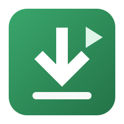
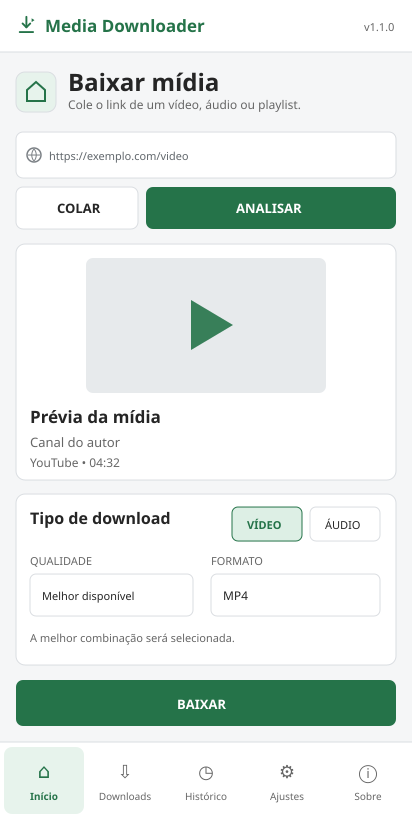
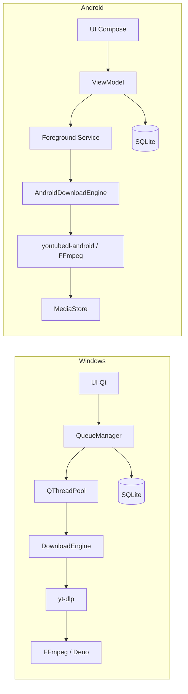

<div align="center">
  
  <h1>Media Downloader</h1>
  <p><strong>Baixe, organize e converta vídeos, áudios e playlists sem sair do seu dispositivo.</strong></p>
  <p>Uma experiência nativa para Windows e Android, com fila controlada, histórico local e opções detalhadas de formato e qualidade.</p>

  <p>
    
    
    
    
    
  </p>

  <p>
    <a href="#visão-geral">Visão geral</a> •
    <a href="#comece-por-aqui">Começar</a> •
    <a href="#desenvolvimento">Desenvolvimento</a> •
    <a href="#arquitetura">Arquitetura</a> •
    <a href="#solução-de-problemas">Ajuda</a>
  </p>
</div>

> [!IMPORTANT]
> Use o aplicativo somente para mídias que você tem autorização para acessar e baixar. O Media Downloader não remove nem contorna DRM.

## Visão geral

O Media Downloader transforma o fluxo de salvar mídia em uma sequência simples:

```text
colar URL  →  analisar  →  escolher formato  →  adicionar à fila  →  acompanhar  →  abrir no histórico
```

O repositório contém **duas aplicações independentes**, criadas para aproveitar o melhor de cada plataforma:

- **Windows:** aplicação desktop em Python, PySide6/Qt, yt-dlp, FFmpeg e Deno;
- **Android:** aplicação nativa em Kotlin e Jetpack Compose, com youtubedl-android, FFmpeg e integração ao MediaStore.

Não existe uma WebView compartilhada entre elas: interface, engine, persistência, testes e processo de build são específicos de cada edição.

<p align="center">
  
</p>
<p align="center"><sub>Prévia ilustrativa da edição desktop.</sub></p>

## O que já funciona

| Área | Recursos |
| --- | --- |
| **Análise** | Título, autor, duração, plataforma, miniatura, playlist e formatos disponíveis sem bloquear a interface |
| **Vídeo** | Seleção automática ou MP4, MKV e WEBM, com limite de resolução |
| **Áudio** | MP3, M4A, OPUS, FLAC e WAV; a edição desktop também oferece AAC |
| **Playlists** | Download integral nas duas edições e seleção item a item no desktop |
| **Legendas** | Legendas oficiais ou automáticas, com opções de download/incorporação conforme a edição |
| **Fila** | Progresso, velocidade, ETA, cancelamento, nova tentativa e estados separados de download e pós-processamento |
| **Histórico** | Persistência local em SQLite, filtros e ações para abrir, compartilhar ou localizar arquivos |
| **Personalização** | Tema claro, escuro ou do sistema; qualidade, formato, destino e preferências persistentes |
| **Manutenção** | Atualização controlada do yt-dlp e componentes empacotados para dispensar configuração manual no uso final |

### Desktop ou Android?

| Capacidade | Windows | Android |
| --- | :---: | :---: |
| Interface nativa | PySide6 / Qt | Kotlin / Compose |
| Vídeo e áudio | ✅ | ✅ |
| Playlists | seleção ou playlist completa | playlist completa |
| Processamento da fila | até 5 downloads concorrentes | persistente, em serviço de primeiro plano |
| Histórico local | pesquisável e filtrável | abrir e compartilhar |
| Cookies e proxy | ✅ | — |
| Template de nome de arquivo | ✅ | — |
| Metadados do Spotify | ✅ | — |
| Destino | pasta configurável | `Downloads/MediaDownloader` |

As plataformas oficiais deste repositório são Windows e Android; não há edição para Web, Linux, macOS ou iOS.

### Plataformas de mídia

A cobertura acompanha os extractors disponíveis no **yt-dlp**. Entre as plataformas reconhecidas pela interface estão YouTube, Vimeo, Twitch, TikTok, Instagram, Facebook, X, Reddit, SoundCloud, Bandcamp, Dailymotion e PeerTube, além de vários outros sites suportados pelo engine instalado.

> [!NOTE]
> Sites mudam com frequência. Uma plataforma listada pode exigir atualização do yt-dlp, autenticação legítima ou cookies do próprio usuário. Compatibilidade com um site não significa permissão para baixar qualquer conteúdo dele.

## Comece por aqui

### Usando o aplicativo

1. Cole ou compartilhe uma URL HTTP/HTTPS com o Media Downloader.
2. Selecione **Analisar** para carregar os metadados e formatos disponíveis.
3. Escolha **Vídeo** ou **Áudio**, a qualidade, o formato e as opções adicionais.
4. Inicie o download e acompanhe o progresso na fila.
5. Abra o arquivo concluído pelo histórico.

Os builds finais já incluem os componentes necessários. Python, FFmpeg, Deno ou Android SDK só são exigidos para desenvolver ou gerar os artefatos localmente.

### Clonando o projeto

```powershell
git clone https://github.com/dokyepepe/mediadown.git
Set-Location mediadown
```

## Desenvolvimento

### Edição Windows

**Requisitos**

- Windows 10 ou 11 x64;
- Python 3.12 ou superior disponível como `python`;
- PowerShell 5.1 ou superior;
- conexão com a internet na primeira configuração.

Prepare um ambiente virtual, instale as dependências e obtenha FFmpeg e Deno com verificação de SHA-256:

```powershell
powershell -ExecutionPolicy Bypass -File .\scripts\setup_dev.ps1
powershell -ExecutionPolicy Bypass -File .\scripts\run_dev.ps1
```

Para trabalhar somente na interface ou nos testes unitários, sem baixar os binários de mídia:

```powershell
.\scripts\setup_dev.ps1 -SkipFFmpeg
```

O script cria `.venv/`, instala `requirements-dev.txt`, gera os ícones e mantém as dependências externas dentro do repositório de trabalho.

### Edição Android

**Requisitos**

- Windows e PowerShell;
- JDK 17 instalado em `C:\Program Files\Java\jdk-17`;
- conexão com a internet na primeira configuração.

O setup instala Android SDK 36 em `.android-sdk/`, sem depender de uma instalação global do Android Studio:

```powershell
powershell -ExecutionPolicy Bypass -File .\scripts\setup_android.ps1 -AcceptSdkLicenses
powershell -ExecutionPolicy Bypass -File .\scripts\build_android.ps1 -Variant Debug
```

O APK de desenvolvimento será copiado para:

```text
release/MediaDownloader-android-debug.apk
```

Para instalar no aparelho conectado por USB:

```powershell
.\scripts\build_android.ps1 -Variant Debug -Install
```

> [!WARNING]
> O APK `Debug` usa a chave de desenvolvimento. Para distribuir a variante `Release`, configure uma `signingConfig` própria; o script interrompe o processo se detectar um APK sem assinatura.

## Testes e qualidade

### Desktop

Execute toda a suíte Python:

```powershell
powershell -ExecutionPolicy Bypass -File .\scripts\test.ps1
```

Ela cobre validação de URLs, nomes e templates, configurações, formatos, fila, histórico, estabilidade do downloader, acessibilidade e comportamento da interface Qt.

Com FFmpeg configurado, também é possível validar offline a cadeia análise → download → extração MP3 usando um servidor HTTP local temporário:

```powershell
$env:PYTHONPATH = "$PWD\src"
.\.venv\Scripts\python.exe .\scripts\smoke_engine.py
```

### Android

Depois de executar `setup_android.ps1`, rode os testes unitários Kotlin:

```powershell
Push-Location .\android
.\gradlew.bat testDebugUnitTest
Pop-Location
```

Downloads reais não fazem parte das suítes unitárias. Antes de publicar uma versão, valide manualmente o engine com conteúdo público autorizado.

## Builds

### Executável Windows

```powershell
powershell -ExecutionPolicy Bypass -File .\scripts\build.ps1
```

O build executa os testes, empacota a aplicação com PyInstaller e faz um smoke test do binário resultante:

```text
dist/MediaDownloader/MediaDownloader.exe
```

O formato `onedir` mantém a inicialização rápida e torna o empacotamento de Qt, FFmpeg, Deno e licenças mais previsível.

### Instalador Windows

Instale o [Inno Setup 6](https://jrsoftware.org/isinfo.php) e gere o instalador:

```powershell
winget install --id JRSoftware.InnoSetup -e
powershell -ExecutionPolicy Bypass -File .\scripts\build_installer.ps1
```

Saída:

```text
release/MediaDownloader-Setup-x64.exe
```

O instalador cria atalhos opcionais, inclui um desinstalador e pergunta se configurações, logs e histórico também devem ser apagados. Por padrão, os dados pessoais são preservados.

### APK Android

```powershell
powershell -ExecutionPolicy Bypass -File .\scripts\build_android.ps1 -Variant Debug
```

As alterações de cada aplicação permanecem isoladas:

- `src/mediadownloader/` e `MediaDownloader.spec` geram a edição Windows;
- `android/` e o Gradle Wrapper geram a edição Android.

## Referência dos scripts

| Script | Função |
| --- | --- |
| `setup_dev.ps1` | Cria a venv, instala dependências e prepara FFmpeg/Deno |
| `run_dev.ps1` | Inicia a interface desktop em modo de desenvolvimento |
| `test.ps1` | Executa os testes Python e repassa argumentos extras ao pytest |
| `build.ps1` | Testa, empacota e valida o executável Windows |
| `build_installer.ps1` | Gera o setup x64 com Inno Setup |
| `setup_ffmpeg.ps1` | Baixa e valida FFmpeg/FFprobe |
| `setup_deno.ps1` | Baixa e valida o runtime Deno |
| `setup_android.ps1` | Instala o Android SDK local e gera `local.properties` |
| `build_android.ps1` | Compila, copia, calcula o SHA-256 e opcionalmente instala o APK |

## Arquitetura

```text
mediadown/
├── src/mediadownloader/   # aplicação desktop
│   ├── ui/                # janela, páginas, tema e widgets Qt
│   ├── core/              # análise, formatos, FFmpeg, workers e fila
│   ├── services/          # configurações, histórico, Spotify e updates
│   ├── models/            # modelos de domínio e opções
│   └── utils/             # paths, logs, erros, validação e formatação
├── android/               # aplicação Kotlin/Jetpack Compose
├── assets/                # marca, ícones e recursos visuais
├── resources/             # binários externos obtidos pelo setup
├── installer/             # projeto Inno Setup
├── scripts/               # desenvolvimento, testes e builds
├── tests/                 # suíte desktop
└── licenses/              # licença do projeto e avisos de terceiros
```

### Fluxo interno



No desktop, operações bloqueantes rodam em `QThreadPool/QRunnable` e voltam à interface por signals/slots; widgets Qt nunca são modificados pelas threads de background. `DownloadEngine` concentra o conhecimento de yt-dlp, enquanto `QueueManager` controla concorrência e ciclo de vida.

No Android, o `ViewModel` coordena a UI e persiste a fila; um serviço em primeiro plano continua o trabalho com notificação de progresso, publica os arquivos pelo MediaStore e registra o histórico local.

## Spotify: metadados, não downloads

A integração do Spotify existe **somente no desktop** e é deliberadamente limitada a metadados:

- links de faixa, álbum, artista, playlist, show, episódio e audiobook podem ser analisados via oEmbed sem login;
- playlists autorizadas podem exibir até 20 itens por OAuth 2.0 Authorization Code com PKCE;
- o botão **Abrir Spotify** leva o usuário ao serviço oficial;
- nenhum áudio do Spotify é baixado, descriptografado, convertido ou exportado.

Para conectar uma playlist da sua conta:

1. Crie um aplicativo no [Spotify Developer Dashboard](https://developer.spotify.com/dashboard).
2. Cadastre exatamente `http://127.0.0.1:43819/callback` em **Redirect URIs**.
3. Copie o **Client ID** — o aplicativo nunca solicita o Client Secret.
4. Em **Ajustes → Spotify**, informe o Client ID e selecione **Conectar conta**.
5. Autorize os escopos de leitura apresentados no navegador.

Os tokens ficam no Gerenciador de Credenciais do Windows, na entrada `MediaDownloader/SpotifyOAuth`, e não no arquivo de configurações. Use **Desconectar** para removê-los. As regras do Development Mode são definidas pelo Spotify e podem mudar; consulte a [documentação oficial de autorização](https://developer.spotify.com/documentation/web-api/concepts/authorization).

## Privacidade e segurança

- não há conta própria, telemetria ou envio do histórico do aplicativo;
- configurações e histórico permanecem no dispositivo;
- logs rotativos aplicam redação a cookies, tokens e credenciais reconhecidos;
- credenciais Spotify usam o cofre nativo do Windows;
- os scripts validam checksums conhecidos ao obter FFmpeg, Deno e Android SDK; o update desktop do yt-dlp confere o SHA-256 publicado pelo PyPI;
- o aplicativo não tenta quebrar DRM ou ignorar restrições da plataforma.

### Onde os dados ficam

| Dado | Windows | Android |
| --- | --- | --- |
| Configurações | `settings.json` sob `%LOCALAPPDATA%`, via `platformdirs` | preferências privadas do app |
| Fila e histórico | `history.sqlite3` sob `%LOCALAPPDATA%` | banco SQLite privado |
| Logs | diretório local de logs resolvido por `platformdirs` | logs do sistema Android |
| Mídias concluídas | pasta escolhida pelo usuário | `Downloads/MediaDownloader` via MediaStore |
| Token Spotify | Gerenciador de Credenciais | não aplicável |

## Solução de problemas

| Sintoma | O que verificar |
| --- | --- |
| **“FFmpeg não encontrado”** | Execute `.\scripts\setup_ffmpeg.ps1` e reinicie o desktop |
| **Um site deixou de funcionar** | Em **Ajustes → Componentes**, verifique ou atualize o yt-dlp |
| **Falha no YouTube** | Confirme também se Deno e yt-dlp-ejs foram preparados pelo setup |
| **Conteúdo privado não abre** | No desktop, configure cookies apenas para uma conta com acesso legítimo |
| **Erro de merge ou conversão** | Confira espaço em disco, logs e a versão do FFmpeg |
| **Build local sinalizado pelo antivírus** | Binários PyInstaller sem assinatura podem gerar falso positivo; distribuições públicas devem usar Authenticode |
| **Spotify não conecta** | Confirme o Client ID, a redirect URI exata e a disponibilidade da porta local `43819` |
| **Playlist Spotify retorna acesso negado** | Verifique se a conta é proprietária/colaboradora e reconecte a autorização |
| **APK não instala** | Ative a depuração USB, autorize o computador e confira a conexão com `adb devices` |
| **Restrição geográfica ou DRM** | O aplicativo informa a restrição, mas não tenta contorná-la |

No Windows, os detalhes técnicos ficam em `app.log`, no diretório retornado por `platformdirs`. Nunca publique um log sem antes revisar URLs e informações pessoais.

## Limitações conhecidas

- pausar a fila desktop impede novos itens de começar, mas não suspende um processo já ativo;
- o tamanho final é estimado quando a plataforma não informa o total;
- MP4 pode exigir remux e algumas combinações dependem do que a origem disponibiliza;
- importação de cookies varia conforme as permissões e mecanismos do navegador;
- executáveis e instaladores locais não recebem assinatura digital automaticamente;
- somente o yt-dlp possui atualização controlada no app; a aplicação completa não tem auto-update;
- a edição Android usa um destino fixo no MediaStore e processa a fila por serviço em primeiro plano;
- o Spotify fornece apenas metadados, limitado aos primeiros 20 itens de playlists autorizadas.

## Versionamento e publicação

A versão desktop tem uma única fonte em `src/mediadownloader/version.py`; o build a aplica aos metadados do executável e o Inno Setup a lê do binário. A versão Android é mantida em `android/app/build.gradle.kts` por `versionName` e `versionCode`.

Antes de publicar:

- mantenha as versões das duas edições alinhadas quando a release incluir ambas;
- execute testes unitários, smoke test e um download manual autorizado;
- gere e confira o SHA-256 dos artefatos;
- use assinatura Authenticode no Windows e uma keystore de release no Android;
- preserve avisos e licenças de todos os componentes empacotados.

## Como contribuir

1. Crie uma branch curta e focada.
2. Mantenha mudanças desktop em `src/mediadownloader/` e mudanças mobile em `android/` sempre que possível.
3. Adicione ou atualize testes para o comportamento alterado.
4. Execute a suíte da edição afetada.
5. Abra um pull request explicando o problema, a solução e como validar.

Relatos de bugs ficam mais úteis quando incluem edição/versão, passos para reproduzir, resultado esperado e mensagem de erro sanitizada. Não anexe cookies, tokens ou credenciais.

## Licença

O código do projeto usa uma [licença permissiva](licenses/APPLICATION_LICENSE.txt). Dependências e componentes empacotados mantêm seus próprios termos; consulte os [avisos de terceiros](licenses/THIRD_PARTY_NOTICES.md).

Ao redistribuir FFmpeg, yt-dlp, Deno, Qt ou qualquer outro componente, preserve os avisos aplicáveis e cumpra as obrigações da configuração efetivamente distribuída.

---

<div align="center">
  <strong>Media Downloader 1.1.0</strong><br>
  <sub>Feito para manter seus downloads organizados, locais e sob seu controle.</sub>
</div>
